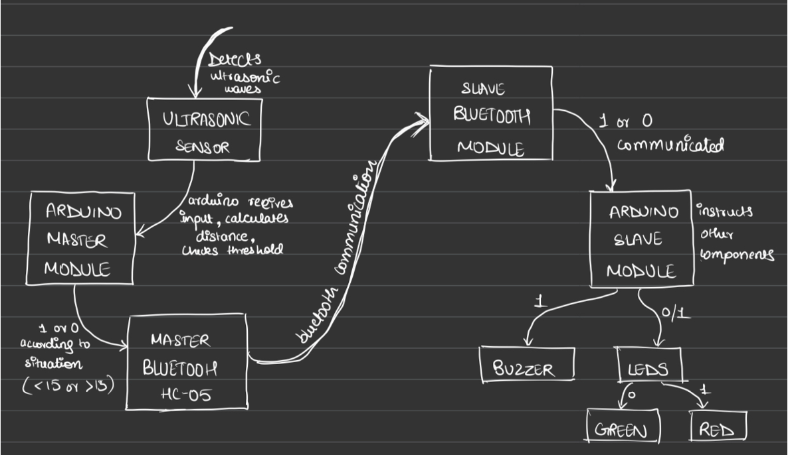
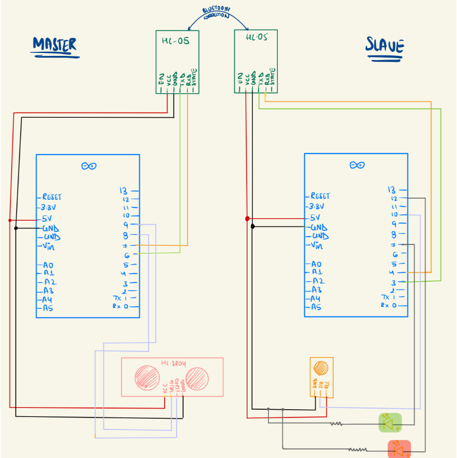
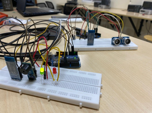
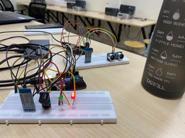

# Arduino-to-Arduino Bluetooth Communication Project  

## Overview  
This project demonstrates real-time **Bluetooth communication between two Arduinos**, leveraging an **ultrasonic sensor** and a **buzzer** to detect obstacles and provide audible warnings. Designed as a **cost-effective safety solution**, the system can classify zones as "Danger" or "Safe" and alert users in real time.  

---

## Problem Statement  
In safety-critical environments, the need for reliable proximity detection and collision prevention is paramount. Current systems are often costly and complex, limiting their accessibility.  
This project focuses on designing a **low-cost solution** using accessible components to:  
- Monitor proximity using an ultrasonic sensor.  
- Classify areas as "Danger Zone" or "Safe Zone."  
- Trigger a remote audible warning via Bluetooth.  

Potential applications include **industrial areas**, **parking systems**, and **IoT-based safety mechanisms**.  

---

## Features   
- **Obstacle Detection**: Detects objects within a predefined range.  
- **Wireless Communication**: Uses Bluetooth modules to transmit data between Arduinos.  
- **Audible Alerts**: Triggers a buzzer on the receiving device for real-time warnings.  
- **Scalability**: Modular design for integration with other systems.  

---

## Project Journey   
Our development journey involved several key steps:  
1. **Component Testing**: Ensured all components performed reliably under various conditions.  
2. **Soldering**: Assembled the hardware using Arduino Nanos for compact design.  
3. **Bluetooth Setup**: Configured HC-05 modules for seamless communication.  
4. **Establishing Communication**: Programmed basic Arduino-to-Arduino Bluetooth messaging.  
5. **Fine-Tuning**: Calibrated ultrasonic sensor thresholds for accurate range detection.  
6. **Debugging**: Resolved hardware and software glitches to achieve stability.  

---

## Components Used   
- 2x Arduino Uno  
- 2x HC-05 Bluetooth Module  
- 1x Ultrasonic Sensor (HC-SR04) 
- 1x Buzzer module
- 2x LEDs
- Jumper wires, resistors, and soldering equipment  

---

## Setup Instructions 
### 1. **Hardware Connections**  
- Connect the **ultrasonic sensor** to the first Arduino:  
  - Trigger Pin → D2  
  - Echo Pin → D3  
- Connect the **HC-05 Bluetooth module** to each Arduino:  
  - RX → D10  
  - TX → D11  
- Connect the **buzzer module** to the second Arduino:  
  - Positive → D4  
  - Negative → GND  

### 2. **Upload Code**  
- Use the provided Arduino sketches in the `codes/` folder.  
  - `master_code.ino`: For the transmitting Arduino (with the ultrasonic sensor).  
  - `slave_code.ino`: For the receiving Arduino (with the buzzer).  

### 3. **Test the System**  
- Power up both Arduinos.  
- Place an object in the ultrasonic sensor’s detection range to observe real-time alerts on the second Arduino.  

---

## Future Applications 
This project serves as a foundation for more advanced systems, such as:  
- **Obstacle Detection in Robotics**: Enhance navigation and safety.  
- **Industrial Safety Systems**: Prevent accidents in manufacturing plants.  
- **IoT-Based Smart Homes**: Integrate with smart devices for automated alerts.  

---

## Project Images  
  

---

## Contributions   
This project was collaboratively developed by:  
- [Shriya](https://www.linkedin.com/in/shriya-kansal/)  
- [Anushka Saini](https://www.linkedin.com/in/anushka-saini-5155a02b5/)  

We welcome feedback and ideas for future enhancements.  
